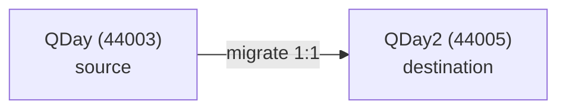

# Network overview

QDay is a quantum-safe, EVM-compatible Layer2. Two chains are relevant:

| | QDay | QDay2 |
|---|---|---|
| Role | Source (lock assets) | Destination (allocate 1:1) |
| Chain ID | 44003 | 44005 |
| RPC | `https://rpc.qday.info` | `https://rpc-test.qday.io` |
| Explorer | explorer.qday.io | explorer-test.qday.io |

Everything EVM works: same JSON-RPC, same Solidity, same tooling. See [Connect / RPC](connect) to wire
your app in, then [Build a dApp](build).
