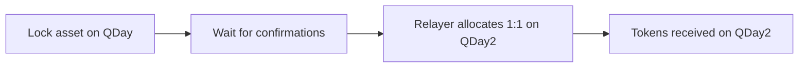

import LiveChainStatus from '@site/src/components/QDay/LiveChainStatus';

# Migrating from QDay to QDay2

You lock an asset **once** on QDay; the equivalent amount is released to you 1:1 on QDay2.

:::danger[Migration is one-way and permanent]
Locking is irreversible. Double-check the amount and recipient before you sign.
:::

## How it works

You only sign **one transaction** (the lock, on QDay). The relayer pays the gas on QDay2.

Live status of both chains:

<LiveChainStatus network="qday" />
<LiveChainStatus network="qday2" />

## What can migrate

| Asset | How |
|---|---|
| USD8 / WABEL / WQDAY | Migrate directly |
| Native QDAY | Wrap to WQDAY first, then migrate |
