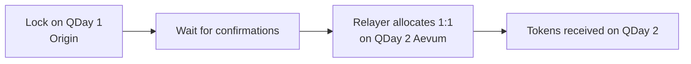

import LiveChainStatus from '@site/src/components/QDay/LiveChainStatus';

# QDay 遷移

目前有兩件不同的事情同時進行。**鏈升級**指的是網路本身：Origin（QDay 1）→ Aevum（QDay 2）。**資產遷移**指的是你的代幣：在 QDay 1 上鎖定，並在 QDay 2 上以 1:1 收到。

---

## 1. 鏈升級

**QDay 1** 是 Origin——目前的正式生產鏈。**QDay 2** 是 Aevum——升級後的網路（新的鏈 ID、新的 RPC、新的區塊瀏覽器）。錢包與 dApp 必須手動新增 QDay 2；它們不會自動跟隨升級。

| | QDay 1（Origin） | QDay 2（Aevum） |
|---|---|---|
| 是什麼 | 目前的正式生產網路 | 升級後的網路 |
| 主網 | **已上線**——鏈 ID `44001` | **尚未開放**——鏈 ID `44002`（即將推出） |
| 測試網 | 已上線——鏈 ID `44003` | **已上線**——鏈 ID `44005`（目前的公開測試網） |

RPC、WebSocket 與區塊瀏覽器：[鏈參數](/Knowledge/reference/chains)。

即時測試網端點：

<LiveChainStatus network="qday" />
<LiveChainStatus network="qday2" />

**這不是什麼。** 將 Aevum 新增到 MetaMask 並不會移動你的餘額。在你完成資產遷移（見下文）之前，代幣仍會留在原本發行的鏈上。

**升級時該做什麼**

1. 新增你需要的鏈：Origin 主網（`44001`）和／或 Aevum 測試網（`44005`）——[將 QDay 新增到你的錢包](/guide/start/add-network)。
2. 當你開始在 QDay 2 上建置或測試時，將應用程式與 RPC 設定指向 Aevum 端點——[網路設定](/Knowledge/technical/developer-guide/network-configuration)。
3. 在 Aevum 主網（`44002`）正式宣布之前，正式環境請繼續使用 Origin 主網。

---

## 2. 鏈上資產遷移

新的鏈存在之後，餘額仍需要被移動。你在 QDay 1 上**一次性**鎖定資產；相同數量會在 QDay 2 上以 **1:1** 釋放給你。

:::danger[單向且永久]
在 QDay 1 上鎖定後無法復原。沒有反向跨鏈橋。簽署前請確認金額與 QDay 2 的接收地址。
:::

### 狀態

- **主網（44001 → 44002）** 尚未開放。在 [官方合約地址](/Knowledge/reference/contracts) 與官方 [入口網站](https://portal.qday.io) 公布地址之前，請勿將 Origin 主網資產發送到任何「遷移」合約。
- **測試網（44003 → 44005）** 是 lockbox 部署後應使用的路徑。Lockbox／distributor 地址在合約頁面上仍標示為*上線時公布*。

### 運作方式

你只需簽署**一筆**交易：在 QDay 1 上的鎖定。中繼者（relayer）會支付 QDay 2 上的 Gas。

| 合約 | 鏈 | 職責 |
|---|---|---|
| MigrationLockbox | QDay 1 | 保管已鎖定的資產（單向） |
| MigrationDistributor | QDay 2 | 從預先注資的資金池以 1:1 撥付給你 |
| MigrationClaim | QDay 2 | 若遷移窗口結束仍未完成中繼時的備援領取機制 |

### 可遷移的資產

兩側資產集合相同，1:1：

| 資產 | 方式 |
|---|---|
| USD8 / WABEL / WQDAY | 在 QDay 1 上鎖定 ERC-20 |
| 原生 QDAY | 先包裝為 **WQDAY**，再鎖定 WQDAY |

目前代幣合約位於 Origin 測試網 `44003`。請參閱 [代幣列表](/Knowledge/reference/tokens)。除非本 wiki 明確指出已部署，否則請勿在 Aevum `44005` 或 Origin 主網 `44001` 上重複使用這些地址。

### 現在該做什麼

1. 等待 [官方合約地址](/Knowledge/reference/contracts) 與 [入口網站](https://portal.qday.io) 公布官方 lockbox 地址。
2. 遷移窗口開放後，只透過這些地址進行鎖定。忽略私訊、空投網站與非官方的「遷移」頁面。
