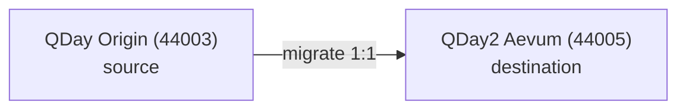

# 網路設定

QDay 是抗量子、相容 EVM 的 Layer 2。目前有兩個相關的網路：**Origin**（來源）與 **Aevum / QDay2**（目的地）。最新的 ID、RPC 與區塊瀏覽器：[鏈參數](/Knowledge/reference/chains)。



| | QDay Origin（主網） | QDay Origin（測試網） | QDay Aevum（測試網） |
|---|---|---|---|
| 角色 | 正式生產環境 Origin | Origin 測試網 | Aevum 目的地（1:1 撥付） |
| 鏈 ID | `44001`（`0xABE1`） | `44003`（`0xABE3`） | `44005`（`0xABE5`） |
| RPC | `https://rpc.qday.io` | `https://rpc.qday.info` | `https://rpc-test.qday.info` |
| WebSocket | `wss://rpc.qday.io` | `wss://rpc.qday.info` | `wss://rpc-test.qday.info` |
| 區塊瀏覽器 | `https://explorer.qday.io` | `https://explorer.qday.info` | `https://explorer-test.qday.info` |
| 貨幣 | QDAY | QDAY | QDAY |

:::warning[測試網與主網]
**44001 是 Origin 主網。** **44005 是目前的公開 Aevum 測試網。** 請務必對照 [鏈參數](/Knowledge/reference/chains) 核對 RPC、鏈 ID 與地址。
:::

## 快速檢查

```bash title="Latest block via curl"
curl -s https://rpc.qday.io \
  -X POST -H 'content-type: application/json' \
  -d '{"jsonrpc":"2.0","id":1,"method":"eth_blockNumber","params":[]}'
```

在錢包中新增此鏈：[錢包整合](/Knowledge/technical/developer-guide/wallet-integration)。接著 [建置你的第一個合約](/Knowledge/technical/developer-guide/smart-contract-development)。
