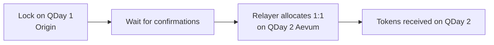

import LiveChainStatus from '@site/src/components/QDay/LiveChainStatus';

# QDay Migration

Two different moves are happening at once. **Chain upgrade** is the network itself: Origin (QDay 1) → Aevum (QDay 2). **Asset migration** is your tokens: lock on QDay 1, receive 1:1 on QDay 2.

---

## 1. Chain upgrade

**QDay 1** is Origin — today’s production chain. **QDay 2** is Aevum — the upgraded network (new chain ID, new RPC, new explorer). Wallets and dApps must add QDay 2; they do not automatically follow the upgrade.

| | QDay 1 (Origin) | QDay 2 (Aevum) |
|---|---|---|
| What it is | Current production network | Upgraded network |
| Mainnet | **Live** — chain ID `44001` | **Not open yet** — chain ID `44002` (coming) |
| Testnet | Live — chain ID `44003` | **Live** — chain ID `44005` (current public testnet) |

RPC, WebSocket, and explorers: [Chain parameters](/Knowledge/reference/chains).

Live testnet endpoints:

<LiveChainStatus network="qday" />
<LiveChainStatus network="qday2" />

**What this is not.** Adding Aevum to MetaMask does not move your balances. Tokens stay on the chain they were issued on until you complete asset migration (below).

**What to do for the upgrade**

1. Add the chain you need: Origin mainnet (`44001`) and/or Aevum testnet (`44005`) — [Add QDay to your wallet](/guide/start/add-network).
2. Point apps and RPC configs at the Aevum endpoint when you start building or testing on QDay 2 — [Connect / RPC](/Knowledge/technical/developer-guide/connect).
3. Keep using Origin mainnet for production until Aevum mainnet (`44002`) is announced.

---

## 2. On-chain asset migration

After the new chain exists, balances still have to be moved. You lock an asset **once** on QDay 1; the same amount is released to you **1:1** on QDay 2.

:::danger[One-way and permanent]
Locking on QDay 1 cannot be undone. There is no reverse bridge. Check the amount and the QDay 2 recipient before you sign.
:::

### Status

- **Mainnet (44001 → 44002)** is not open. Do not send Origin mainnet assets to any “migration” contract until addresses are published on [Official contract addresses](/Knowledge/reference/contracts) and the official [portal](https://portal.qday.io).
- **Testnet (44003 → 44005)** is the path to use when the lockbox is deployed. Lockbox / distributor addresses are still *at launch* on the contracts page.

### How it works

You sign **one** transaction: the lock on QDay 1. The relayer pays gas on QDay 2.

| Contract | Chain | Job |
|---|---|---|
| MigrationLockbox | QDay 1 | Holds locked assets (one-way) |
| MigrationDistributor | QDay 2 | Credits you 1:1 from the pre-funded pool |
| MigrationClaim | QDay 2 | Backstop claim if the window ends without a relay |

### What can migrate

Same asset set on both sides, 1:1:

| Asset | How |
|---|---|
| USD8 / WABEL / WQDAY | Lock the ERC-20 on QDay 1 |
| Native QDAY | Wrap to **WQDAY** first, then lock WQDAY |

Token contracts today are on Origin testnet `44003`. See [Token list](/Knowledge/reference/tokens). Do not reuse those addresses on Aevum `44005` or Origin mainnet `44001` unless this wiki says they are deployed there.

### What to do now

1. Wait for official lockbox addresses on [Official contract addresses](/Knowledge/reference/contracts) and the [portal](https://portal.qday.io).
2. When the window opens, lock only through those addresses. Ignore DMs, airdrop sites, and unofficial “migration” pages.
