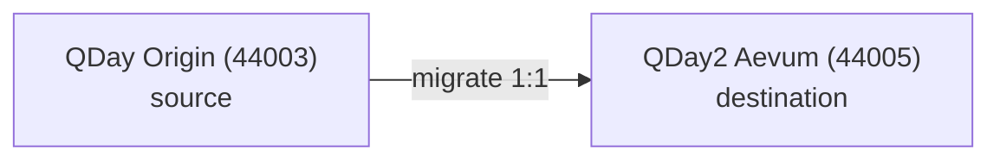

# Network Configuration

QDay is a quantum-safe, EVM-compatible Layer 2. Two networks are relevant today: **Origin** (source) and **Aevum / QDay2** (destination). Live IDs, RPCs, and explorers: [Chain parameters](/Knowledge/reference/chains).



| | QDay Origin (mainnet) | QDay Origin (testnet) | QDay Aevum (testnet) |
|---|---|---|---|
| Role | Production Origin | Origin testnet | Aevum destination (1:1 allocate) |
| Chain ID | `44001` (`0xABE1`) | `44003` (`0xABE3`) | `44005` (`0xABE5`) |
| RPC | `https://rpc.qday.io` | `https://rpc.qday.info` | `https://rpc-test.qday.info` |
| WebSocket | `wss://rpc.qday.io` | `wss://rpc.qday.info` | `wss://rpc-test.qday.info` |
| Explorer | `https://explorer.qday.io` | `https://explorer.qday.info` | `https://explorer-test.qday.info` |
| Currency | QDAY | QDAY | QDAY |

:::warning[Testnet vs mainnet]
**44001 is Origin mainnet.** **44005 is the current public Aevum testnet.** Always verify RPC, chain ID, and addresses against [Chain parameters](/Knowledge/reference/chains).
:::

## Quick check

```bash title="Latest block via curl"
curl -s https://rpc.qday.io \
  -X POST -H 'content-type: application/json' \
  -d '{"jsonrpc":"2.0","id":1,"method":"eth_blockNumber","params":[]}'
```

Add the chain in a wallet: [Wallet Integration](/Knowledge/technical/developer-guide/wallet-integration). Then [build a first contract](/Knowledge/technical/developer-guide/smart-contract-development).
